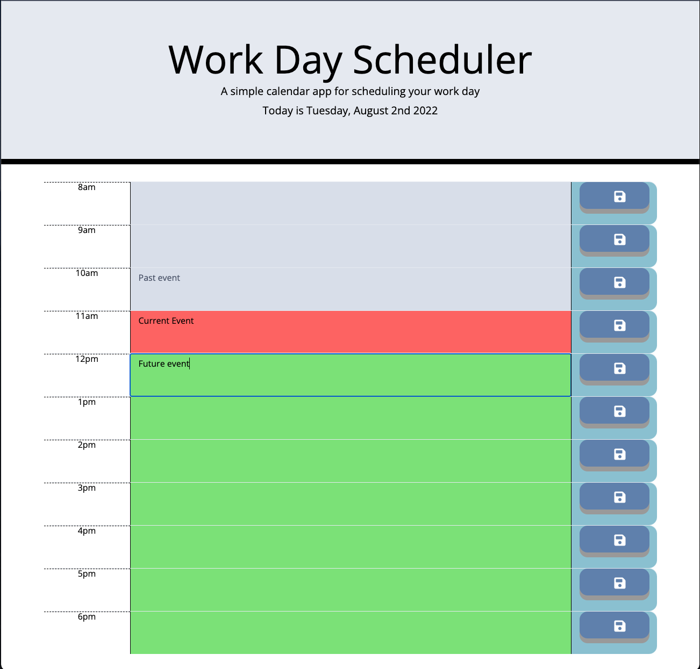

# 05-Work-Day-Scheduler

## Description

This is the module 05 "Work Day Scheduler" by Jonathan Shogren. The challange was to make an hourly calendar that could take input and store it locally on pressing save.

Here is a link to the live finished page: https://shogren.github.io/05-Work-Day-Scheduler/

## User Story

> AS AN employee with a busy schedule
>
>I WANT to add important events to a daily planner
>
>SO THAT I can manage my time effectively

## Screenshot

Here is a screenshot of the finished site:

## Additional Notes

* This was a challenging project. I started by overthinking and overengineering, and ended up starting from scratch a few times to land on the current simpler solution.

* I might go back and add some functionality at some point, it'd be interesting to see this paired with future database work
